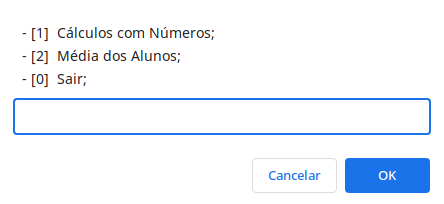

# Lógica de Programação

O que será abordado nesse desafio:

- Variáveis;
- Operações matemáticas;
- Operadores comparativos;
- Condicional;
- Estrutura de dados com objetos;
- Estrutura de repetição;
- Criação de funções;
- Operadores comparativos;

<a href="https://codepen.io/lucasmoraesdev/pen/WNyEdRV">Link!</a>
